# SQL Server Management Studio Tips
Most tips works for SSMS higher 2008 but some of them only for SSMS 2016 and above

Content:
1. [Import and Export Settings](#1)
2. [SSMS Shortcuts](#2)
3. [Keyboard Shortcuts for Favorite Stored Procedures](#3)
4. [Script any object with data](#4)
5. [Selecting a block of text using the ALT Key](#5)
6. [Script Table and Column Names by Dragging from Object Explorer](#6)
7. [Disable Copy of Empty Text](#7)
8. [Client Statistics](#8)
9. [Configure Object Explorer to Script Compression and Partition Schemes for Indexes](#9)
10. [Using GO X to Execute a Batch or Statement Multiple Times](#10)
11. [SSMS Template Replacement](#11)
12. [Color coding of connections](#12)
13. [SQLCMD mode](#13)
14. [Script multiple objects using the Object Explorer Details Windows](#14)
15. [Registered Servers / Central Management Server](#15)
16. [Splitting the Query Window](#16)
17. [Moving columns in the results pane](#17)
18. [Generating Charts and Drawings in SQL Server Management Studio](#18)
19. [Additional Connection Parameters](#19)
20. [Working with tabs headers](#20)
21. [Hiding tables in SSMS Object Explorer](#21)
22. [UnDock Tabs and Windows for Multi Monitor Support](#22)
23. [RegEx-Based Finding and Replacing of Text in SSMS](#23)
24. [Changing what SSMS opens on startup](#24)
25. [Query Execution Options](#25)
26. [Reference](#reference)


<a id="1"></a>
## Import and Export Settings
`Tools > Options > Environment > Import and Export Settings`

You can configure so many settings in SSMS and then export it and use on all your computers.
Below link provide detailed instruction and awesome Dark theme configuration: [Making SSMS Pretty: My Dark Theme](https://blogs.sentryone.com/aaronbertrand/making-ssms-pretty-my-dark-theme/)

Also you can create shared team settings file and use it from network location.
Detailed information you can find in this article [Symbolic Links for Sharing Template Files or "How I Broke Management Studio with Symbolic Links"](http://sqlmag.com/sql-server/symbolic-links-sharing-template-files-or-how-i-broke-management-studio-symbolic-links)

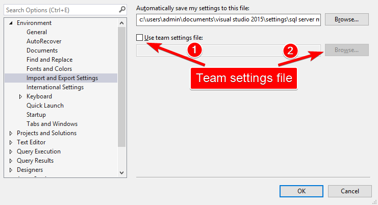


<a id="2"></a>
## SSMS Shortcuts
All 957 shortcuts you can find [here](https://github.com/ktaranov/sqlserver-kit/blob/master/SSMS/SSMS_Shortcuts.md)

Most useful are:

| Shortcut              | Description                            |
|-----------------------|----------------------------------------|
| `Ctrl + U`            | Change Selected Database               |
| `Ctrl + R`            | Toggle Results Pane                    |
| `Ctrl + Space`        | Activate Autocomplete                  |
| `Ctrl + Shift + V`    | [Cycle through clipboard ring]         |
| `Ctrl + ]`            | Navigate to matching parenthesis       |
| `Ctrl + –`            | Navigate to last cursor location       |
| `Ctrl + Shift + –`    | Navigate forward to cursor location    |
| `Ctrl + K, Ctrl + C`  | Comments selected text                 |
| `Ctrl + K, Ctrl + U`  | Uncomments selected text               |
| `Ctrl + K, Ctrl + K`  | Toggle Bookmark                        |
| `Ctrl + K, Ctrl + N`  | Go to Next Bookmark                    |
| `Ctrl + L`            | Display Estimated Query Execution plan |
| `Shift + Alt + Enter` | View Code Editor in Full Screen        |
| `Ctrl + I`            | Quick Search                           |
| `Ctrl + F4`           | Close the current MDI child window     |
| `Ctrl + F5`           | Parse query  to check for errors       |
| `Shift + F10`         | Simulate right mouse button            |
| `Ctrl + Alt + T`      | Display Template Explorer              |
| `Ctrl + Shift + M`    | Specify values for template parameters |


<a id="3"></a>
## Keyboard Shortcuts for Favorite Stored Procedures
`Tools > Options > Environment > Keyboard > Query Shortcuts`

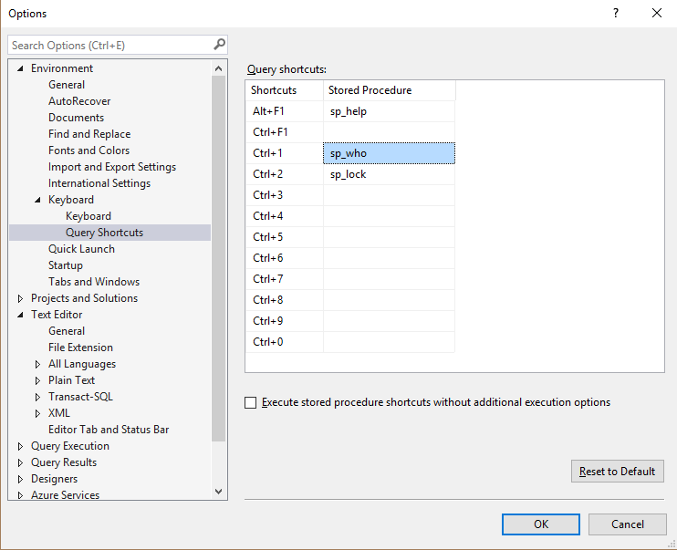

My recommendation (awesome open source Brent Ozar teams procedures and with some limitations Adam Machanic `sp_WhoIsActive`):

| Query Shortcut | Stored Procedure     |
|----------------|----------------------|
| `Alt + F1`     | [sp_help]            |
| `Ctrl + F1`    | [sp_WhoIsActive]     |
| `Ctrl + 1`     | [sp_who]             |
| `Ctrl + 2`     | [sp_lock]            |
| `Ctrl + 3`     | [sp_Blitz]           |
| `Ctrl + 4`     | [sp_BlitzCache]      |
| `Ctrl + 5`     | [sp_BlitzWho]        |
| `Ctrl + 6`     |                      |
| `Ctrl + 7`     |                      |
| `Ctrl + 8`     |                      |
| `Ctrl + 9`     | [sp_BlitzTrace]      |
| `Ctrl + 0`     |                      |

Also recommended [sp_DatabaseRestore]

[sp_help]:https://docs.microsoft.com/en-us/sql/relational-databases/system-stored-procedures/sp-help-transact-sql
[sp_who]:https://docs.microsoft.com/en-us/sql/relational-databases/system-stored-procedures/sp-who-transact-sql
[sp_lock]:https://docs.microsoft.com/en-us/sql/relational-databases/system-stored-procedures/sp-lock-transact-sql
[sp_WhoIsActive]:http://whoisactive.com
[sp_Blitz]:https://github.com/BrentOzarULTD/SQL-Server-First-Responder-Kit/blob/dev/sp_Blitz.sql
[sp_BlitzCache]:https://github.com/BrentOzarULTD/SQL-Server-First-Responder-Kit/blob/dev/sp_BlitzCache.sql
[sp_BlitzWho]:https://github.com/BrentOzarULTD/SQL-Server-First-Responder-Kit/blob/dev/sp_BlitzWho.sql
[sp_BlitzTrace]:https://github.com/BrentOzarULTD/SQL-Server-First-Responder-Kit/blob/dev/sp_BlitzTrace.sql
[sp_DatabaseRestore]:https://github.com/BrentOzarULTD/SQL-Server-First-Responder-Kit/blob/dev/sp_DatabaseRestore.sql


<a id="4"></a>
## Script any object with data
`Right click on database name > Tasks > Generate Scripts …`

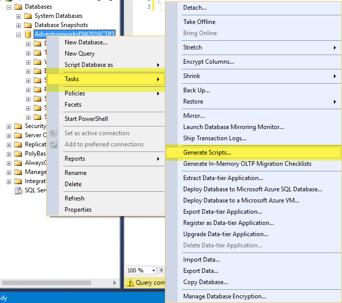


<a id="5"></a>
## Selecting a block of text using the ALT Key
By holding down the ALT key as you select a block of text you can control the width of the selection region as well as the number of rows.
Also you can activate multi line mode with `Shift + Alt` keys and using keyboard arrows to format multi line code.


<a id="6"></a>
## Script Table and Column Names by Dragging from Object Explorer
Save keystrokes by dragging
Drag the `Columns` folder for a table in to auto-type all column names in the table in a single line.
 - Warning: this doesn’t include [brackets] around the column names, so if your columns contain spaces or special characters at the beginning, this shortcut isn’t for you
 - Dragging the table name over will auto-type the schema and table name, with brackets.


<a id="7"></a>
## Disable Copy of Empty Text

 - Select a block of text to copy;
 - Move the cursor the place where you want to paste the code;
 - Accidentally press `Ctrl+C` again instead of `Ctrl+V`;
 - Block of copied text is replaced by an empty block;

This behavior can be disabled in SSMS: go to `Tools > Options > Text Editor > All Languages > General > 'Apply Cut or Copy Commands to blank lines when there is no selection'` and uncheck the checkbox.

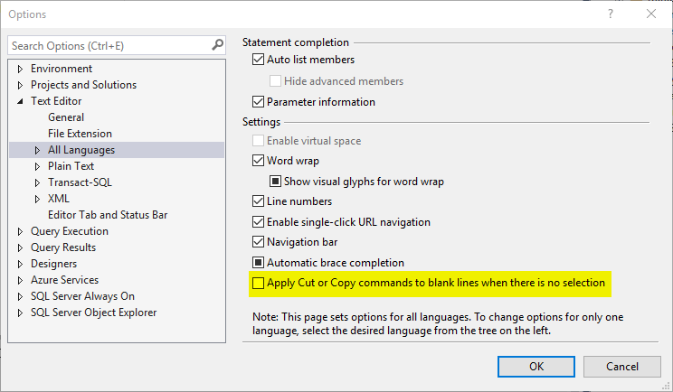


<a id="8"></a>
## Client Statistics
When you enable that option for your session, SQL Server Management Studio will give you more information about the client side processing of your query.

The Network Statistics shows you the following information:
 - Number of Server Roundtrips
 - TDS Packets sent from Client
 - TDS Packets received from Server
 - Bytes sent from Client
 - Bytes received from Server

The Time Statistics additionally shows you the following information:
 - Client Processing Time
 - Total Execution Time
 - Wait Time on Server Replies


<a id="9"></a>
## Configure Object Explorer to Script Compression and Partition Schemes for Indexes
Is this index compressed or partitioned?

By default, you wouldn’t know just by scripting out the index from Object Explorer. If you script out indexes this way to check them into source code, or to tweak the definition slightly, this can lead you to make mistakes.

You can make sure you’re aware when indexes have compression or are partitioned by changing your scripting settings:
- Click `Tools – > Options -> SQL Server Object Explorer -> Scripting`
- Scroll down in the right pane of options and set both of these to `True`
  - *Script Data Compression Options*
  - *Script Partition Schemes*
- Click OK


<a id="10"></a>
## Using GO X to Execute a Batch or Statement Multiple Times
The `GO` command marks the end of a batch of statements that should be sent to SQL Server for processing, and then compiled into a single execution plan. 
By specifying a number after the ‘GO’ the batch can be run specified number of times. This can be useful if, for instance, you want to create test data by running an insert statement a number of times. Note that this is not a Transact SQL statement and will only work in Management Studio (and also SQLCMD or OSQL). For instance the following SQL can be run in SSMS :

```sql
CREATE TABLE TestData(ID INT IDENTITY (1,1), CreatedDate DATETIME)
GO

INSERT INTO TestData(CreatedDate) SELECT GetDate()
GO 10
```

This will run the insert statement 10 times and therefore insert 10 rows into the TestData table.
In this case this is a simpler alternative than creating a cursor or while loop.


<a id="11"></a>
## SSMS Template Replacement
One under-used feature of Management Studio is the template replacement feature. SSMS comes with a library of templates, but you can also make your own templates for reusable scripts.

In your saved .sql script, just use the magic incantation to denote the parameters for replacement. The format is simple: `<label, datatype, default value>`

Then, when you open the `.sql` script, you hit `CTRL + Shift + M`, and SSMS will give you a pop-up to enter your replacement values.


<a id="12"></a>
## Color coding of connections
SQL Server Management Studio has the capability of coloring the bar at the bottom of each query window, with the color dependent on which server is connected.
This can be useful in order to provide a visual check of the server that a query is to be run against, for instance to color code production instances as red, development as green and amber as test.
This can also be used in conjunction with Registered Servers and CMS (Central Management Server).
To add a color bar when connecting to the server click on the Options button in the Connect to Database Engine window and then select the Connection Properties window.
Select the check box towards the bottom of the window and use the ‘Select…’ button to choose a color.


<a id="13"></a>
## SQLCMD mode
Switching on SQLCMD mode enables a number of useful extra scripting style commands in SSMS.
In particular you can use it to change to the connection credentials within the query window, so that you can run a query against multiple servers from the same query window.
There are more details of how to do this here: [Changing the SQL Server connection within an SSMS Query Windows using SQLCMD Mode](http://www.sqlmatters.com/Articles/Changing%20the%20SQL%20Server%20connection%20within%20an%20SSMS%20Query%20Windows%20using%20SQLCMD%20Mode.aspx)


<a id="14"></a>
## Script multiple objects using the Object Explorer Details Windows
Individual database objects, such as a table or stored procedure, can be scripted within SSMS by right clicking on the object within Object Explorer and selecting the appropriate item in the drop down menu.
However if you have a lot of objects to script that can quickly become time consuming.
Fortunately it’s possible to select multiple objects and script them up all together in a single query window.
To do this just open the Object Explorer Details window from the View menu (or press the F7 key).
If you want to script up multiple (or all) tables, select the Tables item under the relevant database in Object Explorer.
A list of all tables appears in the Object Explorer Details window.
Select the tables you want to script (using the Control key if necessary) and then right click and select which script option you want – e.g. to create a table create script for all tables


<a id="15"></a>
## Registered Servers / Central Management Server
If you have a lot of servers then re-entering the details in Object Explorer every time you start SSMS can be frustrating and time consuming.
Fortunately there are two facilities within SSMS that enable these details to be entered just once and "remembered" each time you open up SSMS.
These two facilities are **Registered Servers** and **Central Management Servers**.
These were introduced in different versions of SQL Server and work in different ways, each has its own advantages and disadvantages so you may want to use both.

To add a registered server open the Registered Servers window from the View menu (or click `CTRL + ALT + G`), the window should appear in the top left corner of SSMS.
Right click on the Local Server Groups folder and select ‘New Server Registration…’. Enter the server details and close the window.
This new server should then appear under Local Server Groups, you can then right click and open up the server in Object Explorer or open a new query window.
The server details are stored locally in an XML file and so will appear next time you open SSMS.
If you have a lot of servers then you can also create Server Groups to group together similar servers.
One advantage of creating groups (other than being able to logically group similar servers together) is that you can run a query against all servers in the group, by right clicking the group and selecting ‘New Group’.

Central Management Server are similar to Registered Servers but with some differences, the main one being that the server details are stored in a database (the Central Management Server) rather than a local file.
A significant limitation with CMS is that the CMS server itself can’t be included in the list of servers.


<a id="16"></a>
## Splitting the Query Window
The query window in SSMS can be split into two so that you can look at two parts of the same query simultaneously.
Both parts of the split window can be scrolled independently. This is especially useful if you have a large query and want to compare different areas of the same query.
To split the window simply drag the bar to the top right hand side of the window as shown below.

The splitter bar allows you to view one session with two panes. You can scroll in each pane independently. You can also edit in both the top and bottom pane.

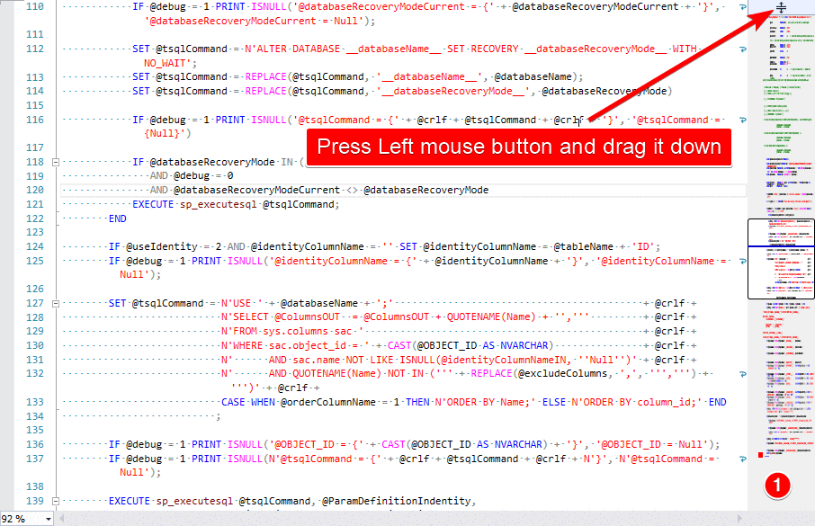


<a id="17"></a>
## Moving columns in the results pane
It may not be immediately obvious but you can switch columns around in the results pane when using the grid view, by dragging the column headers and dropping them next to another column header.
This can be useful if you want to rearrange how the results are displayed without amending the query, especially if you have a lot of columns in your result set.
This works only for one column.


<a id="18"></a>
## Generating Charts and Drawings in SQL Server Management Studio
You don't have to settle for T-SQL's monochrome text output. These stored procedures let you quickly and easily turn your SELECT queries' output into colorized charts and even computer-generated art.
To turn your own data into a line, column, area, or bar chart using the Chart stored procedure, you need to design a SELECT query that serves as the first parameter in the stored procedure call.

Detailed article and code here: [Generating Charts and Drawings in SQL Server Management Studio]

Also you can generate amazing chart using awesome R libraries, detailed article: [View R Plots from within SQL Server Management Studio]


<a id="19"></a>
## Additional Connection Parameters
One such change SSMS got for free is the connection resiliency logic within the SqlConnection.Open() method.
To improve the default experience for clients which connect to Azure SQL Database, the above method will (in the case of initial connection errors / timeouts) now retry 1 time after sleeping for 10 seconds. These numbers are configurable by properties called ConnectRetryCount (default value 1) and ConnectRetryInterval (default value 10 seconds.)
The previous versions of the SqlConnection class would not automatically retry in cases of connection failure.

There is a simple workaround for this situation. It is to add the following parameter string into the `Additional Connection Parameters` tab within the SSMS connection window. The good news is that you only need to do this once, as the property is saved for future sessions for that SQL Server (until of course it is removed by you later.)
```
ConnectRetryCount=0
```

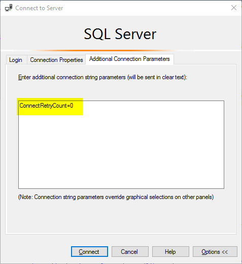


<a id="20"></a>
## Working with tabs headers
You can view [SPID](https://docs.microsoft.com/en-us/sql/t-sql/functions/spid-transact-sql) in tabs header, quickly script open containing folder or copy script file path.

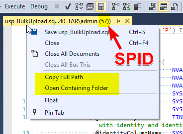


<a id="21"></a>
## Hiding tables in SSMS Object Explorer
1. You can actually hide an object from object explorer by assigning a specific extended property:
```
EXEC sp_addextendedproperty
@name = N'microsoft_database_tools_support',
@value = 'Hide',
@level0type = N'Schema', @level0name = 'Person',
@level1type = N'Table', @level1name = 'Address';
GO
```

You can then remove the property (and the object will show back up) like so:
```
EXEC sp_dropextendedproperty
@name = N'microsoft_database_tools_support',
@level0type = N'Schema', @level0name = 'Person',
@level1type = N'Table', @level1name = 'Address';
GO
```

2. DENY VIEW DEFINITION
```
DENY VIEW DEFINITION ON Schema.Table TO UserName;
```

Now UserName won’t be able to see Table in `Object Explorer`.
In Fact, they won’t be able to see the table in `sys.tables` or `INFORMATION_SCHEMA.TABLES`

`VIEW DEFINITION` is the ability to see the definition of the object (duh). In the case of SPs the code, same with Views and in the case of Tables it’s the columns definitions etc.


<a id="22"></a>
## UnDock Tabs and Windows for Multi Monitor Support
From SSMS 2012 and onwards, you can easily dock/undock the query tabs as well as different object windows inside SSMS to make better use of the screen real estate and multiple monitors you have.

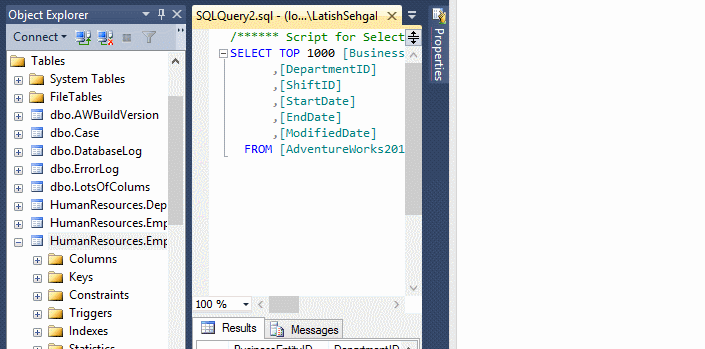


<a id="23"></a>
## RegEx-Based Finding and Replacing of Text in SSMS
So often, one sees developers doing repetitive coding in SSMS or Visual Studio that would be much quicker and easier by using the built-in Regular-Expression-based Find/Replace functionality.
It is understandable, since the syntax is odd and some features are missing, but it is still well-worth knowing about.

More details and examples you can find here [RegEx-Based Finding and Replacing of Text in SSMS].

My favorite regex: replace `\t` on `\n, `. It useful in many cases when you have column names copied from, for example, Excel and need quickly get sql query.


<a id="24"></a>
## Changing what SSMS opens on startup
You can customize SSMS startup behavior in `Tools -> Options -> Environment -> Startup` and hide system objects in Object Explore:

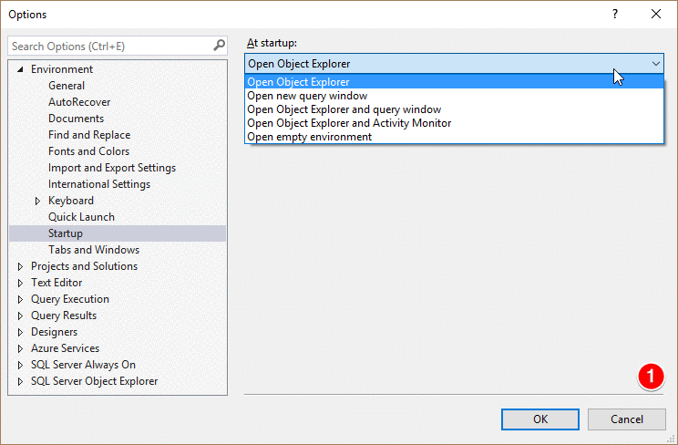

Also you can disable the splash screen - this cuts the time it takes SSMS to load for versions before SSMS 17.
Right click your shortcut to SSMS and select properties.
Enter the text `-nosplash` right after the ending quote in the path.


It is useful to create a solution of commonly used SQL scripts to always load at start-up.
1. Display the Solution Explorer by pressing `Ctrl+Alt+L` or clicking `View -> Solution Explorer`.
2. Then right click the `Solution "Solution1" (0 projects)` text and select `Add -> New Project`.
3. Use the default `SQL Server Scripts` template and give your solution a clever name.
4. Rename all of your SQL Code Snippets so the extension is .SQL. Drag them into the queries folder within the Solution Explorer.
5. Open Windows explorer and browse to the location of your solution. Copy file location address to your clipboard. 
Go back to your SSMS shortcut properties and add within double quotes the location and file name of your solution before the "-nosplash".

This is the complete text within my shortcut properties:

```
"C:\Program Files (x86)\Microsoft SQL Server\140\Tools\Binn\ManagementStudio\Ssms.exe" "C:\Users\taranov\Documents\SQL Server Management Studio\Projects\MySQLServerScripts.ssmssln" -nosplash
```

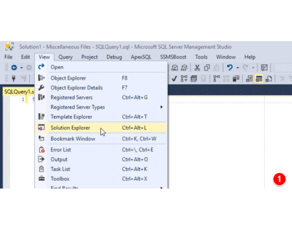


<a id="25"></a>
## Query Execution Options
More detailed article here: [Knowing the Options]

The options represent the SET values of the current session.
`SET options` can affect how the query is execute thus having a different execution plan.
You can find these options in two places within SSMS under `Tools -> Options -> Query Execution -> SQL Server -> Advanced`:

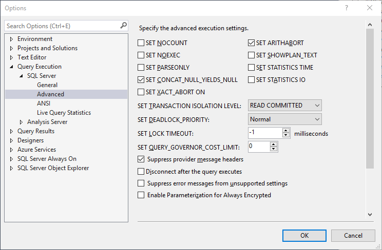

As well as `Tools -> Options -> Query Execution -> SQL Server -> ANSI`:

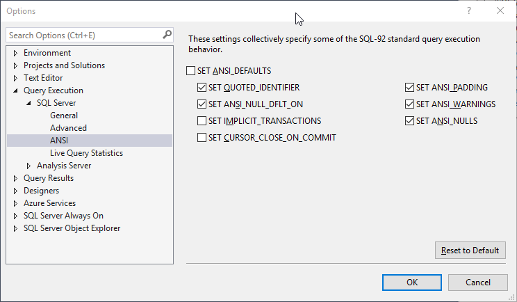

Using the interface to check what is set can get tiresome. Instead, you can use the system function `@@OPTIONS`.
Each option shown above has a BIT value for all 15 options indicating whether or not it is enabled.

`@@OPTIONS` takes the binary representation and does a BITWISE operation on it to produce an integer value based on the sum of which BITS are enabled.

Default value for `SELECT @@OPTIONS` is 5496.
Let’s assume for a moment that the only two options that are enabled on my machine are ANSI_PADDING and ANSI_WARNINGS.
The values for these two options are 8 and 16, respectively speaking. The sum of the two is 24.

```sql
/***************************************************************
  Author: John Morehouse
  Summary: This script display what SET options are enabled for the current session.
 
  You may alter this code for your own purposes. You may republish altered code as long as you give due credit.
 
  THIS CODE AND INFORMATION IS PROVIDED "AS IS" WITHOUT WARRANTY OF ANY KIND, EITHER EXPRESSED OR IMPLIED, INCLUDING BUT NOT LIMITED TO THE IMPLIED WARRANTIES OF MERCHANTABILITY AND/OR FITNESS FOR A PARTICULAR PURPOSE.
***************************************************************/
SELECT 'Disable_Def_Cnst_Chk'    AS 'Option', CASE @@options & 1     WHEN 0 THEN 0 ELSE 1 END AS 'Enabled/Disabled' UNION ALL
SELECT 'IMPLICIT_TRANSACTIONS'   AS 'Option', CASE @@options & 2     WHEN 0 THEN 0 ELSE 1 END AS 'Enabled/Disabled' UNION ALL
SELECT 'CURSOR_CLOSE_ON_COMMIT'  AS 'Option', CASE @@options & 4     WHEN 0 THEN 0 ELSE 1 END AS 'Enabled/Disabled' UNION ALL
SELECT 'ANSI_WARNINGS'           AS 'Option', CASE @@options & 8     WHEN 0 THEN 0 ELSE 1 END AS 'Enabled/Disabled' UNION ALL
SELECT 'ANSI_PADDING'            AS 'Option', CASE @@options & 16    WHEN 0 THEN 0 ELSE 1 END AS 'Enabled/Disabled' UNION ALL
SELECT 'ANSI_NULLS'              AS 'Option', CASE @@options & 32    WHEN 0 THEN 0 ELSE 1 END AS 'Enabled/Disabled' UNION ALL
SELECT 'ARITHABORT'              AS 'Option', CASE @@options & 64    WHEN 0 THEN 0 ELSE 1 END AS 'Enabled/Disabled' UNION ALL
SELECT 'ARITHIGNORE'             AS 'Option', CASE @@options & 128   WHEN 0 THEN 0 ELSE 1 END AS 'Enabled/Disabled' UNION ALL
SELECT 'QUOTED_IDENTIFIER'       AS 'Option', CASE @@options & 256   WHEN 0 THEN 0 ELSE 1 END AS 'Enabled/Disabled' UNION ALL
SELECT 'NOCOUNT'                 AS 'Option', CASE @@options & 512   WHEN 0 THEN 0 ELSE 1 END AS 'Enabled/Disabled' UNION ALL
SELECT 'ANSI_NULL_DFLT_ON'       AS 'Option', CASE @@options & 1024  WHEN 0 THEN 0 ELSE 1 END AS 'Enabled/Disabled' UNION ALL
SELECT 'ANSI_NULL_DFLT_OFF'      AS 'Option', CASE @@options & 2048  WHEN 0 THEN 0 ELSE 1 END AS 'Enabled/Disabled' UNION ALL
SELECT 'CONCAT_NULL_YIELDS_NULL' AS 'Option', CASE @@options & 4096  WHEN 0 THEN 0 ELSE 1 END AS 'Enabled/Disabled' UNION ALL
SELECT 'NUMERIC_ROUNDABORT'      AS 'Option', CASE @@options & 8192  WHEN 0 THEN 0 ELSE 1 END AS 'Enabled/Disabled' UNION ALL
SELECT 'XACT_ABORT'              AS 'Option', CASE @@options & 16384 WHEN 0 THEN 0 ELSE 1 END AS 'Enabled/Disabled';
```


<a id="reference"></a>
Reference:
 - [Free Course: SQL Server Management Studio Shortcuts & Secrets](https://sqlworkbooks.com/course/sql-server-management-studio-shortcuts-secrets/) (by Kendra Little)
 - [SSMS Tips: Templates and Control+Shift+M] (by Kendra Little)
 - [Fixing Hot-Key issue in SSMS in five steps](http://slavasql.blogspot.ru/2017/02/fixing-hot-key-issue-in-ssms-in-five.html) (by Slava Murygin)
 - [SSMS Tips and Tricks](http://www.ssmstipsandtricks.com/) (by Latish Sehgal)
 - [Do you need more than STATISTICS IO for Query Tuning?](https://www.sqlpassion.at/archive/2017/03/27/do-you-need-more-than-statistics-io-for-query-tuning/) (by Klaus Aschenbrenner)
 - [Top 10 SQL Server Management Studio (SSMS) Tips and Tricks](http://www.sqlmatters.com/Articles/Top%2010%20SQL%20Server%20Management%20Studio%20(SSMS)%20Tips%20and%20Tricks.aspx) (by SQLMatters)
 - [Keyboard shortcut to close a query tab in SSMS](https://www.am2.co/2017/01/close-ssms-tab/) (by Andy Mallon)
 - [SQL Server Management Studio Tips](https://www.mssqltips.com/sql-server-tip-category/52/sql-server-management-studio/) (by MSSQLTips)
 - [Generating Charts and Drawings in SQL Server Management Studio] (by Anthony Zanevsky, Andrew Zanevsky and Katrin Zanevsky)
 - [Try and try again: not always a good idea (at least not for SSMS!)](https://blogs.msdn.microsoft.com/sqlcat/2017/04/06/try-and-try-again-not-always-a-good-idea-at-least-not-for-ssms/) (by Arvind Shyamsundar)
 - [SSMS Tips: Copy Full Path](https://sqlstudies.com/2017/04/24/ssms-tips-copy-full-path/) (by Kenneth Fisher)
 - [Hiding tables in SSMS Object Explorer](https://sqlstudies.com/2017/04/03/hiding-tables-in-ssms-object-explorer-using-extended-properties/) (by Kenneth Fisher)
 - [Changing what SSMS opens on startup](https://sqlstudies.com/2017/02/01/changing-what-ssms-opens-on-startup/) (by Kenneth Fisher)
 - [Presenting: Presentation Mode!](http://www.williamdurkin.com/2017/03/presenting-presentation-mode/) (by William Durkin)
 - [RegEx-Based Finding and Replacing of Text in SSMS] (by Phil Factor)
 - [SQL Server Management Studio (SSMS) Tips and Tricks] (by Mike Milligan)
 - [Knowing the Options] (by John Morehouse)

[Cycle through clipboard ring]:http://www.ssmstipsandtricks.com/blog/2014/05/05/cycle-through-clipboard-ring/
[SSMS Tips: Templates and Control+Shift+M]:http://littlekendra.com/2016/08/09/ssms-tips-templates-and-controlshiftm/
[Generating Charts and Drawings in SQL Server Management Studio]:http://sqlmag.com/t-sql/generating-charts-and-drawings-sql-server-management-studio
[View R Plots from within SQL Server Management Studio]:http://www.sqlservercentral.com/articles/R+Services/156107/
[RegEx-Based Finding and Replacing of Text in SSMS]:https://www.simple-talk.com/sql/sql-training/regex-based-finding-and-replacing-of-text-in-ssms/
[SQL Server Management Studio (SSMS) Tips and Tricks]:http://www.bidn.com/blogs/MMilligan/bidn-blog/3326/sql-server-management-studio-ssms-tips-and-tricks
[Knowing the Options]:http://sqlrus.com/2017/05/knowing-the-options/
